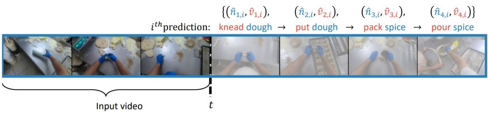

<p align="center">
   <br>
</p>

# Long-Term Action Anticipation with Memory-Augmented MViT

This repository contains code for long-term action anticipation on the Ego4D dataset using a Memory-Augmented Multiscale Vision Transformer (MeMViT) architecture. This work builds upon the [original Ego4D baseline implementation](https://github.com/EGO4D/forecasting/blob/main/LONG_TERM_ANTICIPATION.md) with modifications to incorporate memory-augmented features in the vision transformer backbone.

## Model Architecture

Our main contribution is the modification of the baseline model to include:
- Memory-Augmented Multiscale Vision Transformer (MeMViT) as the backbone
- Enhanced temporal modeling through memory-based attention mechanisms

## Data and Models
Download all necessary data and model checkpoints using the [Ego4D CLI tool](https://github.com/facebookresearch/Ego4d/blob/main/ego4d/cli/README.md) and link the necessary files to the project directory.

```bash
# set download dir for Ego4D
export EGO4D_DIR=/path/to/Ego4D/

# download annotation jsons, clips and models for the FHO tasks
python -m ego4d.cli.cli \
    --output_directory=${EGO4D_DIR} \
    --datasets annotations clips lta_models \
    --benchmarks FHO

# link data to the current project directory
mkdir -p data/long_term_anticipation/annotations/ data/long_term_anticipation/clips_hq/
ln -s ${EGO4D_DIR}/v1/annotations/* data/long_term_anticipation/annotations/
ln -s ${EGO4D_DIR}/v1/clips/* data/long_term_anticipation/clips_hq/

# link model files to current project directory
mkdir -p pretrained_models
ln -s ${EGO4D_DIR}/v1/lta_models/* pretrained_models/
```

The `data/long_term_anticipation/annotations` directory should contain the following files:

```
fho_lta_train.json
fho_lta_val.json
fho_lta_test_unannotated.json
fho_lta_taxonomy.json
```

Where `fho_lta_train.json`, `fho_lta_val.json` and `fho_lta_test_unannotated.json` contain the training, validation and test annotations, respectively, and `fho_lta_taxonomy.json` contains the verb/noun class id to text mapping.

### Downsampling Video Clips
To allow dataloaders to load clips efficiently, we will downsample video clips to 320p using ffmpeg. The script can be found at `tools/long_term_anticipation/resize_clips.sh` and can be run in parallel as a SLURM array job. Remember to adjust the paths and SLURM parameters before running.

```bash
sbatch tools/long_term_anticipation/resize_clips.sh
```
This will create and populate `data/long_term_anticipation/clips/` with downsampled clips.

## Training

### Train an Ego4D Recognition Backbone Model
```bash
bash tools/long_term_anticipation/ego4d_recognition.sh checkpoints/recognition/
```

### Train the Long-Term Anticipation Model
```bash
bash tools/long_term_anticipation/ego4d_forecasting.sh checkpoints/forecasting/
```

## Generate Predictions

Model predictions on the test set can be generated using the following script:
```bash
# Generate model predictions (outputs.json)
bash tools/long_term_anticipation/evaluate_forecasting.sh output/
```

## Acknowledgments

This implementation is based on the original Ego4D long-term anticipation baseline. We extend our gratitude to the Ego4D team for providing the foundation for this work. The data preparation, training pipeline, and evaluation scripts remain largely unchanged from the original implementation.
